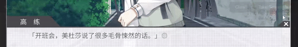

# CN_Overlay
This is a prototype implementation of an overlay that allows hovering over on-screen simplified Chinese characters to show their definition/pronounciation, or to easily copy the text. It was mostly designed as a learning aid for use with visual novels.  
You can highlight individual characters to look them up, in case they constitute a larger word.  
It only works on Windows.  
# Usage
Run start.bat, that should start the ocr server and the overlay.

# Demo

Full video:  http://www.youtube.com/watch?v=ysYjwLEV95Q